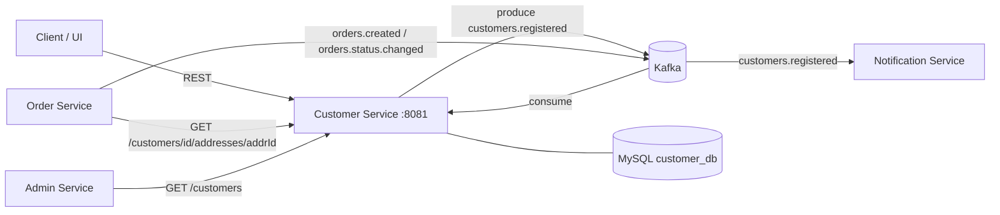
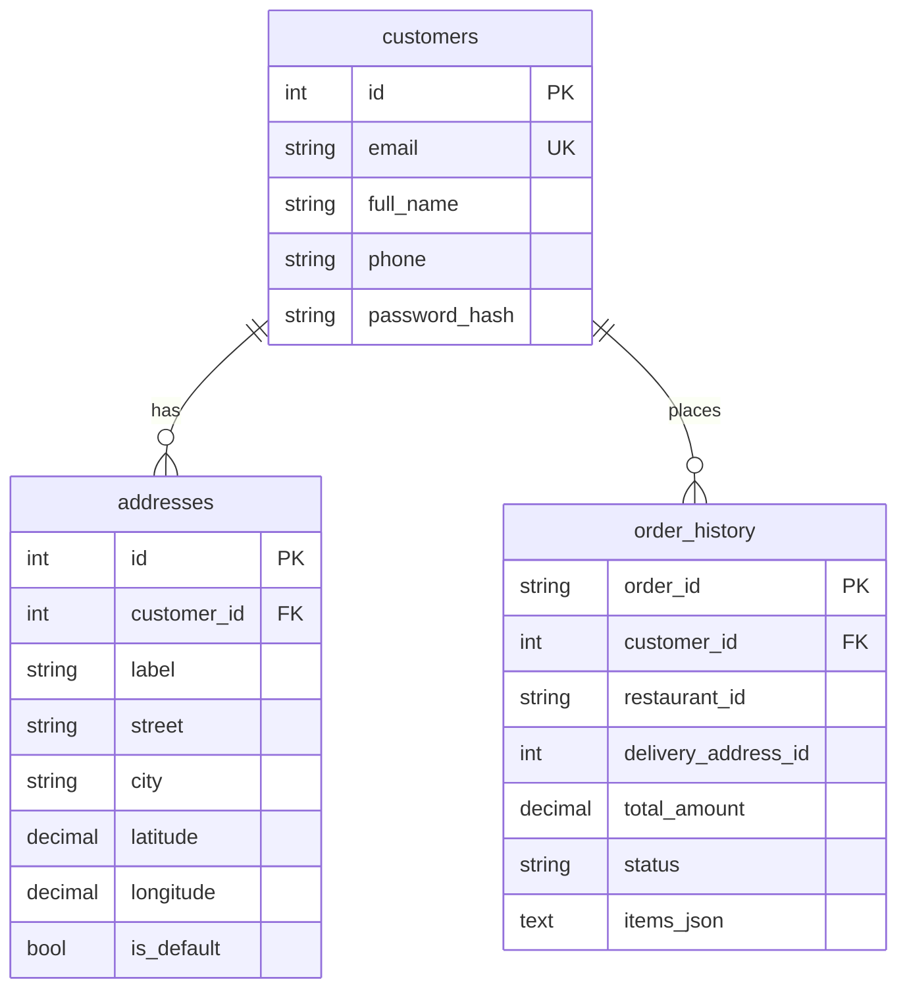

# Customer Service — DSA612S Assignment 2 (Person 1)

**Owner:** Person 1 · **Language:** Ballerina (Swan Lake) · **DB:** MySQL 8 · **Messaging:** Kafka · **Port:** `8081`

Responsibility (from the team split): *user accounts, delivery addresses, order history, database, REST APIs.*

---

## 1. Where it sits in the platform



Each service owns its own database (database-per-service). Order history is a **read model** built from Kafka events, so the
Customer Service never calls the Order Service synchronously and keeps working if it is down.

## 2. Code layout

```
customer-service/
├── Ballerina.toml            package + distribution
├── Config.toml.example       local config template (copy to Config.toml)
├── config.bal                configurable vars (DB, Kafka, topics, port)
├── types.bal                 API records, DB row records, Kafka event contracts
├── utils.bal                 validation, bcrypt hashing, HTTP error helpers
├── db.bal                    MySQL client + idempotent schema creation (init())
├── repository.bal            ALL SQL (parameterised) - customers, addresses, orders
├── service_customers.bal     HTTP listener, /customers resources, /health
├── kafka_producer.bal        publishes customers.registered
├── kafka_consumer.bal        consumes orders.created + orders.status.changed
├── sql/schema.sql            same DDL for manual setup / documentation
├── tests/validation_test.bal unit tests (validation + hashing)
├── scripts/create-topics.sh  creates topics (3 partitions)
├── scripts/publish-test-events.sh  fakes Order Service events for testing
├── Dockerfile                multi-stage build -> JRE runtime image
├── docker-compose.dev.yml    MySQL + Kafka + this service, stand-alone
└── README.md
```
Layering: **service (HTTP/Kafka) → repository (SQL) → db client**. Handlers never contain SQL.

## 3. Data model



Key decisions: unique `email`; bcrypt `password_hash`; `ON DELETE CASCADE`; index `(customer_id, created_at)` for fast history
paging; `latitude/longitude` prepared for the *Driver Location* bonus; `order_history.delivery_address_id` has **no FK** so
deleting an address never destroys history.

## 4. REST API

| Method | Path | Success | Errors | Notes |
|---|---|---|---|---|
| POST | `/customers` | 201 + `Location` | 400, 409 (email taken) | Register; publishes `customers.registered` |
| POST | `/customers/login` | 200 | 401 | Same message for bad email/password |
| GET | `/customers?page=&pageSize=` | 200 | 400 | Paginated (max 100); for Admin |
| GET | `/customers/{id}` | 200 | 404 | |
| PUT | `/customers/{id}` | 200 | 400, 404 | Updates name + phone |
| DELETE | `/customers/{id}` | 204 | 404 | Cascades to addresses/orders |
| POST | `/customers/{id}/addresses` | 201 | 400, 404 | First address auto-default |
| GET | `/customers/{id}/addresses` | 200 | 404 | Default first |
| GET | `/customers/{id}/addresses/{addrId}` | 200 | 404 | **Used by Order Service** to validate address |
| PUT | `/customers/{id}/addresses/{addrId}` | 200 | 400, 404 | |
| PUT | `/customers/{id}/addresses/{addrId}/default` | 200 | 404 | Transactional switch |
| DELETE | `/customers/{id}/addresses/{addrId}` | 204 | 404 | Promotes another default if needed |
| GET | `/customers/{id}/orders?status=&page=&pageSize=` | 200 | 400, 404 | Newest first |
| GET | `/customers/{id}/orders/{orderId}` | 200 | 404 | |
| GET | `/health` | 200 | 503 | DB ping, used by Docker healthcheck |

All errors share one body: `{"code":"NOT_FOUND","message":"..."}`.

## 5. Kafka contract (agree with Person 3, 5 and 6)

| Topic | Direction | Key | Payload |
|---|---|---|---|
| `orders.created` | **consume** | `orderId` | `{orderId, customerId, restaurantId, totalAmount, deliveryAddressId?, items?}` |
| `orders.status.changed` | **consume** | `orderId` | `{orderId, status}` — status ∈ CREATED, CONFIRMED, PREPARING, READY, OUT_FOR_DELIVERY, DELIVERED, CANCELLED |
| `customers.registered` | **produce** | `customerId` | `{eventType, customerId, fullName, email, phone, occurredAt}` |

Reliability: producer `acks=all` + 3 retries; consumer group `customer-service-group`; upsert is idempotent (safe on
re-delivery, never regresses status); each record is processed in its own error scope so a poison message cannot block a
partition; status events for a not-yet-seen order are retried 3×; Kafka failure never fails a registration.

> If Person 3 uses different topic names/fields, change only `config.bal` / `OrderCreatedEvent` in `types.bal`.

## 6. Run it

**Prerequisites:** Ballerina 2201.10.x (`bal version`), Docker.

```bash
# 1) infra
docker compose -f docker-compose.dev.yml up -d mysql kafka
./scripts/create-topics.sh

# 2) service (local)
cp Config.toml.example Config.toml
bal run                    # http://localhost:8081

# or everything in containers
docker compose -f docker-compose.dev.yml up -d --build

# 3) tests (needs infra running)
bal test
```
Env-var overrides in Docker follow `BAL_CONFIG_VAR_<UPPERCASENAME>` (e.g. `BAL_CONFIG_VAR_DBHOST=mysql`).

## 7. Try it (curl)

```bash
# register
curl -s -X POST localhost:8081/customers -H 'Content-Type: application/json' \
  -d '{"fullName":"Ndapanda Shikongo","email":"nd@example.com","phone":"+264811234567","password":"Secret123"}'

# login
curl -s -X POST localhost:8081/customers/login -H 'Content-Type: application/json' \
  -d '{"email":"nd@example.com","password":"Secret123"}'

# add address (becomes default)
curl -s -X POST localhost:8081/customers/1/addresses -H 'Content-Type: application/json' \
  -d '{"label":"Home","street":"12 Independence Ave","city":"Windhoek","region":"Khomas","latitude":-22.5609,"longitude":17.0658}'

# list addresses / make #2 default
curl -s localhost:8081/customers/1/addresses
curl -s -X PUT localhost:8081/customers/1/addresses/2/default

# simulate Order Service events, then read history
./scripts/publish-test-events.sh 1
curl -s "localhost:8081/customers/1/orders?status=DELIVERED"

# error cases worth demoing
curl -i -X POST localhost:8081/customers -H 'Content-Type: application/json' \
  -d '{"fullName":"X","email":"bad","phone":"1","password":"x"}'     # 400
# registering the same email twice                                    # 409
```

## 8. What other team members need from you

| Person | Needs | You give |
|---|---|---|
| 3 – Order | validate customer/address before creating an order | `GET /customers/{id}`, `GET /customers/{id}/addresses/{addrId}` (404 = invalid) ; keep `orders.created` payload per §5 |
| 5 – Notification | contact details on signup | consume `customers.registered`; or `GET /customers/{id}` |
| 6 – Admin/Infra | topics, compose entry, DB container | topics in §5 (3 partitions), `Dockerfile`, env vars in `config.bal`, service name `customer-service`, port 8081, `/health` |

## 9. Defence cheat-sheet (be ready to explain)

* **Why a read model for order history?** Decoupling + fault tolerance: no synchronous dependency on Order Service; survives its downtime.
* **Why idempotent upsert?** Kafka is at-least-once; duplicates must not corrupt data.
* **Why transactions on addresses?** "Exactly one default address" must hold under concurrent requests.
* **How is scalability handled?** Stateless service, connection pool, consumer group + partitions → run N replicas.
* **Security:** bcrypt, parameterised SQL, no hash in responses, generic login error. *Not done:* JWT/authz (listed as extension).
* **Why `409` vs `400`?** Business conflict (duplicate email) vs malformed input.

## 10. Known limitations / extensions

JWT authentication & role checks; rate-limiting login; soft-delete of customers; address snapshot stored inside each order;
Prometheus metrics (`observabilityIncluded = true` is already set — Person 6 can scrape it for the observability bonus).
