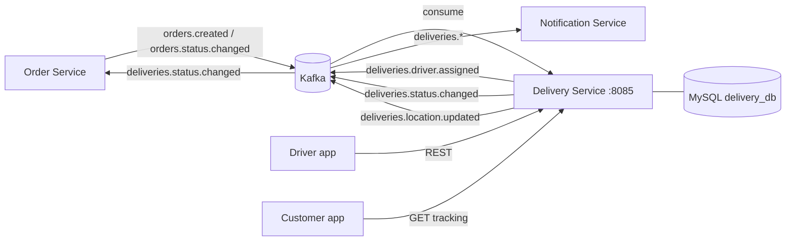

# Delivery Service

**Language:** Ballerina (Swan Lake) · **DB:** MySQL 8 (`delivery_db`) · **Messaging:** Kafka · **Port:** `8085`

Responsibility: *driver assignment, delivery tracking and the delivery Kafka events.*

## 1. Where it sits



The service never calls another service over HTTP. Everything it knows about an order comes from Kafka,
so it keeps working when the Order Service is down.

## 2. Code layout

```
delivery-service/
├── config.bal              configurable vars (DB, Kafka, topics, port)
├── types.bal               API records, Kafka event contracts, status constants
├── utils.bal               validation + HTTP error helpers
├── db.bal                  MySQL client + schema creation on start-up
├── repository.bal          all SQL
├── assignment.bal          driver assignment rules
├── tracking.bal            delivery lifecycle, driver location, tracking view
├── service_drivers.bal     /drivers + /health
├── service_deliveries.bal  /deliveries
├── kafka_consumer.bal      orders.created, orders.status.changed
├── kafka_producer.bal      deliveries.driver.assigned / status.changed / location.updated
├── sql/schema.sql          same DDL for manual setup
├── scripts/                create-topics.sh, simulate-events.sh
└── tests/tracking_test.bal lifecycle + validation unit tests
```

## 3. Delivery lifecycle

```
PENDING ──READY──> AWAITING_DRIVER ──driver claimed──> ASSIGNED ──picked up──> OUT_FOR_DELIVERY ──> DELIVERED
   └───────────────────────┴──────────────────────────────┴──> CANCELLED (order cancelled before pickup)
```

| Status | Set by | Meaning |
|---|---|---|
| `PENDING` | `orders.created` | order exists, kitchen is still busy |
| `AWAITING_DRIVER` | `orders.status.changed` = `READY` | food is ready, in the queue for a driver |
| `ASSIGNED` | assignment | driver is heading to the restaurant |
| `OUT_FOR_DELIVERY` | driver app | driver has the food |
| `DELIVERED` | driver app | done, driver is free again |
| `CANCELLED` | `orders.status.changed` = `CANCELLED` | called off before pickup |

## 4. Driver assignment

* A driver is `OFFLINE`, `AVAILABLE` or `BUSY`. Only `AVAILABLE` drivers get work.
* The driver who has been idle the longest is picked first, so jobs are shared out fairly.
* Claiming the driver and attaching them to the delivery is one transaction with the expected status in each
  `WHERE` clause. Two replicas can't give the same driver two orders, the loser just tries the next driver.
* No driver free? The delivery stays `AWAITING_DRIVER`. The queue is checked again whenever a driver comes
  online, finishes a drop-off or is released by a cancellation. Oldest order first.
* `POST /deliveries/{orderId}/assign` lets an admin force it, with or without naming the driver.

## 5. REST API

| Method | Path | Success | Errors | Notes |
|---|---|---|---|---|
| POST | `/drivers` | 201 + `Location` | 400, 409 (phone taken) | new drivers start `OFFLINE` |
| GET | `/drivers?status=` | 200 | 400 | |
| GET | `/drivers/{id}` | 200 | 404 | |
| PUT | `/drivers/{id}/status` | 200 | 400, 404, 409 (on a delivery) | body `{"status":"AVAILABLE"}` or `OFFLINE` |
| PUT | `/drivers/{id}/location` | 200 | 400, 404 | body `{"latitude":..,"longitude":..}` |
| GET | `/drivers/{id}/deliveries?status=` | 200 | 400, 404 | the driver's jobs |
| POST | `/deliveries` | 201 | 400 | manual fallback, body `{"orderId":"..."}` |
| GET | `/deliveries?status=&driverId=&page=&pageSize=` | 200 | 400 | `status=AWAITING_DRIVER` is the queue |
| GET | `/deliveries/{orderId}` | 200 | 404 | |
| POST | `/deliveries/{orderId}/assign` | 200 | 404, 409 | body `{}` or `{"driverId":3}` |
| PUT | `/deliveries/{orderId}/status` | 200 | 400, 404, 409 | `OUT_FOR_DELIVERY` or `DELIVERED` |
| GET | `/deliveries/{orderId}/tracking` | 200 | 404 | status + driver + position + timeline |
| GET | `/health` | 200 | 503 | DB ping |

Errors share the body used by the other services: `{"code":"NOT_FOUND","message":"..."}`.

## 6. Kafka contract

| Topic | Direction | Key | Payload |
|---|---|---|---|
| `orders.created` | consume | `orderId` | `{orderId, customerId, restaurantId, deliveryAddressId?, ...}` |
| `orders.status.changed` | consume | `orderId` | `{orderId, status}`, we act on `READY` and `CANCELLED` |
| `deliveries.driver.assigned` | produce | `orderId` | `{eventType, orderId, customerId, restaurantId, driverId, driverName, driverPhone, vehicle, plateNumber, occurredAt}` |
| `deliveries.status.changed` | produce | `orderId` | `{eventType, orderId, status, customerId, driverId, occurredAt}`, status is `OUT_FOR_DELIVERY`, `DELIVERED` or `CANCELLED` |
| `deliveries.location.updated` | produce | `orderId` | `{eventType, orderId, driverId, latitude, longitude, occurredAt}` |

The Order Service reads `orderId` + `status` from `deliveries.status.changed` and moves the order to
`OUT_FOR_DELIVERY` / `DELIVERED`. `CANCELLED` is only sent when a driver had already been assigned.

Reliability: producer `acks=all` + 3 retries; consumer group `delivery-service-group`; every handler is safe to
run twice (Kafka is at-least-once); each record is processed in its own error scope.

## 7. Run it

```bash
docker compose -f docker-compose.dev.yml up -d mysql kafka
./scripts/create-topics.sh

cp Config.toml.example Config.toml
bal run                                  # http://localhost:8085

# or everything in containers
docker compose -f docker-compose.dev.yml up -d --build
```

## 8. Try it

```bash
# a driver signs up and goes on shift
curl -s -X POST localhost:8085/drivers -H 'Content-Type: application/json' \
  -d '{"fullName":"Johannes Shilongo","phone":"+264811000001","vehicle":"motorbike","plateNumber":"N 1001 W"}'
curl -s -X PUT localhost:8085/drivers/1/status -H 'Content-Type: application/json' -d '{"status":"AVAILABLE"}'

# an order is placed and the kitchen finishes it
./scripts/simulate-events.sh order-1 created
./scripts/simulate-events.sh order-1 ready
curl -s localhost:8085/deliveries/order-1            # ASSIGNED, driverId 1

# the driver moves, picks up and delivers
curl -s -X PUT localhost:8085/drivers/1/location -H 'Content-Type: application/json' \
  -d '{"latitude":-22.5609,"longitude":17.0658}'
curl -s -X PUT localhost:8085/deliveries/order-1/status -H 'Content-Type: application/json' -d '{"status":"OUT_FOR_DELIVERY"}'
curl -s localhost:8085/deliveries/order-1/tracking
curl -s -X PUT localhost:8085/deliveries/order-1/status -H 'Content-Type: application/json' -d '{"status":"DELIVERED"}'

# what went out on Kafka
./scripts/simulate-events.sh order-1 watch
```

## 9. Known limitations

* The nearest driver is not considered, only who has waited longest. Driver positions are stored, so picking
  by distance to the restaurant is the obvious next step.
* Only the latest driver position is kept, there is no route history.
* No authentication, any caller can act as any driver.
