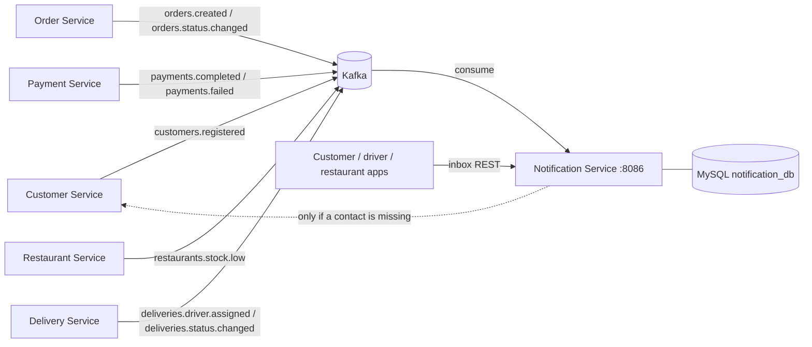

# Notification Service

**Language:** Ballerina (Swan Lake) · **DB:** MySQL 8 (`notification_db`) · **Messaging:** Kafka · **Port:** `8086`

Responsibility: *tell customers, drivers and restaurants what is happening, based on the events the other services publish.*

## 1. Where it sits



The service only listens. It publishes nothing, and no other service depends on it being up.

## 2. Code layout

```
notification-service/
├── config.bal                 configurable vars (DB, Kafka, topics, port)
├── types.bal                  API records, Kafka event contracts
├── utils.bal                  validation + HTTP error helpers
├── db.bal                     MySQL client + schema creation on start-up
├── repository.bal             all SQL
├── templates.bal              the wording of every notification
├── notifier.bal               picks the channel, stores, sends
├── kafka_consumer.bal         one handler per topic
├── service_notifications.bal  /notifications + /health
├── sql/schema.sql             same DDL for manual setup
├── scripts/                   create-topics.sh, publish-test-events.sh
└── tests/templates_test.bal   wording + validation unit tests
```

## 3. What triggers a notification

| Topic | Who is told | Notification (`eventType`) |
|---|---|---|
| `customers.registered` | customer | welcome (`CUSTOMER_WELCOME`), contact details are stored |
| `orders.created` | customer | order received (`ORDER_CREATED`) |
| `orders.status.changed` | customer | `ORDER_CONFIRMED`, `ORDER_PREPARING`, `ORDER_READY`, `ORDER_OUT_FOR_DELIVERY`, `ORDER_DELIVERED`, `ORDER_CANCELLED` |
| `payments.completed` | customer | `PAYMENT_COMPLETED` |
| `payments.failed` | customer | `PAYMENT_FAILED` |
| `deliveries.driver.assigned` | customer and driver | `DRIVER_ASSIGNED` (who is coming), `DELIVERY_JOB` (new job for the driver) |
| `deliveries.status.changed` | customer or driver | `ORDER_OUT_FOR_DELIVERY`, `ORDER_DELIVERED`; `DELIVERY_CANCELLED` goes to the driver |
| `restaurants.stock.low` | restaurant | `STOCK_LOW` |

Channels: customers get an **e-mail** when we know their address (from `customers.registered`, or looked up once from
the Customer Service), drivers get an **SMS** to the number in the event, everything else is **in-app** only. Every
notification is also stored, so it is always in the recipient's inbox.

There is no mail server or SMS gateway in the assignment setup, so sending is simulated with a log line
(`deliver()` in `notifier.bal`). That function is the only thing to replace for a real provider.

## 4. No duplicates

Kafka delivers at least once, and `OUT_FOR_DELIVERY` / `DELIVERED` arrive twice by design (once from the Delivery
Service, once repeated by the Order Service). Every notification built from an event has a `dedupe_key` such as
`<orderId>:ORDER_DELIVERED` with a UNIQUE index, and it is stored before it is sent, so a repeat is dropped.

## 5. REST API

| Method | Path | Success | Errors | Notes |
|---|---|---|---|---|
| GET | `/notifications?recipientType=&recipientId=&unreadOnly=&page=&pageSize=` | 200 | 400 | newest first |
| GET | `/notifications/{id}` | 200 | 404 | |
| PUT | `/notifications/{id}/read` | 200 | 404 | |
| POST | `/notifications` | 201 | 400 | manual message: `{recipientType, recipientId, title, message, orderId?}` |
| GET | `/notifications/customers/{customerId}?unreadOnly=` | 200 | 400 | the customer's inbox |
| GET | `/notifications/customers/{customerId}/unread-count` | 200 | | `{customerId, unread}` |
| PUT | `/notifications/customers/{customerId}/read` | 200 | | mark all as read |
| GET | `/health` | 200 | 503 | DB ping |

## 6. Run it

```bash
docker compose -f docker-compose.dev.yml up -d mysql kafka
./scripts/create-topics.sh

cp Config.toml.example Config.toml
bal run                                  # http://localhost:8086

# or everything in containers
docker compose -f docker-compose.dev.yml up -d --build
```

## 7. Try it

```bash
# one customer signs up and one order goes all the way to delivered
./scripts/publish-test-events.sh 1 order-1

curl -s localhost:8086/notifications/customers/1                 # the whole story, newest first
curl -s localhost:8086/notifications/customers/1/unread-count
curl -s "localhost:8086/notifications?recipientType=DRIVER&recipientId=1"
curl -s "localhost:8086/notifications?recipientType=RESTAURANT&recipientId=1"
curl -s -X PUT localhost:8086/notifications/1/read

# a message by hand
curl -s -X POST localhost:8086/notifications -H 'Content-Type: application/json' \
  -d '{"recipientType":"CUSTOMER","recipientId":1,"title":"Service notice","message":"We are closed on Sunday."}'
```

Run the script twice: the second run adds nothing to the inbox.

## 8. Known limitations

* E-mail and SMS are simulated (logged), not really sent.
* There is no contact list for restaurants or a stored one for drivers, so those are in-app (drivers get an SMS
  only for events that carry their number).
* No authentication on the inbox endpoints.
