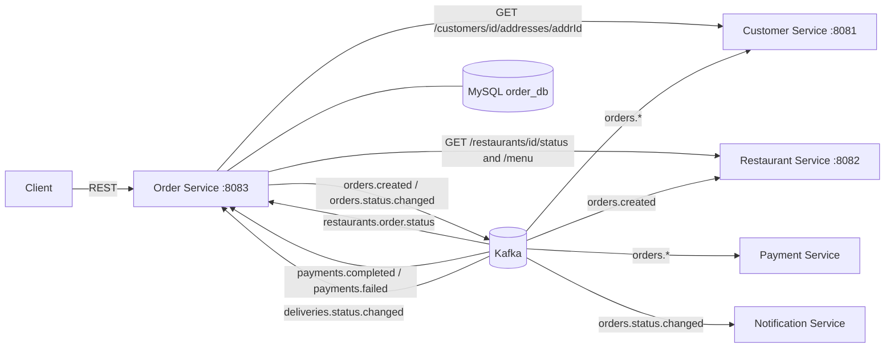
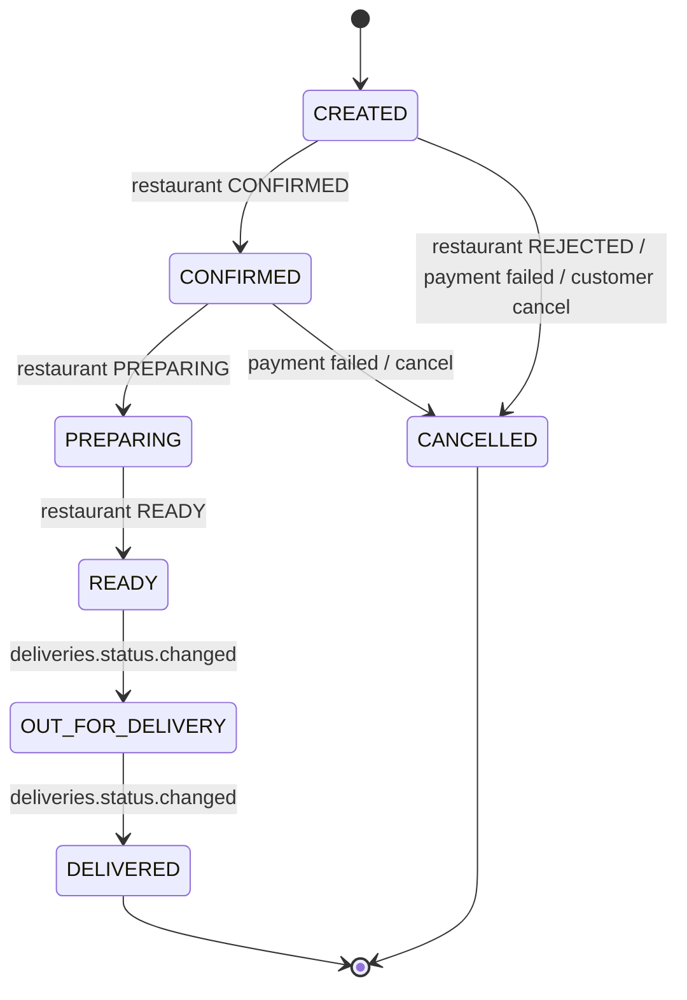

# Order Service — DSA612S Assignment 2 (Person 3)

**Language:** Ballerina (Swan Lake 2201.10.x) · **DB:** MySQL 8 (`order_db`) · **Messaging:** Kafka · **Port:** `8083`

Responsibility: *order lifecycle / state machine, order database, Kafka events.*

## 1. Where it sits



## 2. State machine



## 3. Data model (own database)

`orders` (PK `order_id` UUID, customer_id, restaurant_id, delivery_address_id, total_amount, status, payment_status PENDING/PAID/FAILED, timestamps) ·
`order_items` (FK → orders, cascade) · `order_status_history` (audit trail: from, to, source, time).

## 4. REST API

| Method | Path | Success | Errors | Notes |
|---|---|---|---|---|
| POST | `/orders` | 201 + `Location` | 400, 404, 409, 503 | Body: `{customerId, restaurantId, deliveryAddressId, items:[{menuItemId, quantity}]}`. Validates address (Customer Svc), restaurant open, menu items; **prices come from the menu**; publishes `orders.created` |
| GET | `/orders?customerId=&status=&page=&pageSize=` | 200 | 400 | Newest first, max 100 |
| GET | `/orders/{id}` | 200 | 404 | |
| GET | `/orders/{id}/history` | 200 | 404 | Status audit trail |
| PUT | `/orders/{id}/status` | 200 | 400, 404, 409 | Manual fallback (PREPARING, READY, CANCELLED); normally Restaurant Service drives this via Kafka |
| POST | `/orders/{id}/cancel` | 200 | 404, 409 | Only from CREATED / CONFIRMED |
| GET | `/health` | 200 | 503 | DB ping |

Errors: `{"code":"NOT_FOUND","message":"..."}`.

## 5. Kafka contract

| Topic | Direction | Key | Payload |
|---|---|---|---|
| `orders.created` | produce | orderId | `{orderId, customerId, restaurantId, totalAmount, deliveryAddressId, items:[{menuItemId,quantity,name,unitPrice}]}` |
| `orders.status.changed` | produce | orderId | `{orderId, status}` |
| `restaurants.order.status` | consume | orderId | Person 2's `RestaurantOrderEvent`: CONFIRMED→CONFIRMED, REJECTED→CANCELLED, PREPARING, READY |
| `payments.completed` | consume | orderId | `{orderId, ...}` → payment_status PAID |
| `payments.failed` | consume | orderId | `{orderId, ...}` → payment_status FAILED + CANCELLED |
| `deliveries.status.changed` | consume | orderId | `{orderId, status}` status ∈ OUT_FOR_DELIVERY, DELIVERED |

Reliability: producer `acks=all` + retries; consumer group `order-service-group`; per-record error scope;
duplicate/late events are no-ops (state machine rejects them); optimistic-concurrency `UPDATE ... WHERE status = :old`.

## 6. Run

```bash
docker compose -f docker-compose.dev.yml up -d
./scripts/create-topics.sh
cp Config.toml.example Config.toml
bal run            # http://localhost:8083
bal test           # needs infra running
```

## 7. Demo

```bash
# create (customer 1, address 1 must exist in Customer Service)
curl -s -X POST localhost:8083/orders -H 'Content-Type: application/json' -d '{
  "customerId":1,"restaurantId":1,"deliveryAddressId":1,
  "items":[{"menuItemId":1,"quantity":2}]}'

ID=<orderId from above>
./scripts/simulate-events.sh $ID restaurant-confirm   # CREATED -> CONFIRMED
./scripts/simulate-events.sh $ID payment-ok           # payment_status -> PAID
./scripts/simulate-events.sh $ID preparing
./scripts/simulate-events.sh $ID ready
./scripts/simulate-events.sh $ID out-for-delivery
./scripts/simulate-events.sh $ID delivered
curl -s localhost:8083/orders/$ID/history

# error cases
curl -i -X PUT localhost:8083/orders/$ID/status -H 'Content-Type: application/json' -d '{"status":"READY"}'   # 409
./scripts/simulate-events.sh $ID ready   # duplicate/late event: ignored, no crash
```

## 8. Defence cheat-sheet

- **Why a state machine?** Prevents impossible states (DELIVERED → CREATED); one function (`applyTransition`) guards REST and Kafka paths.
- **Why optimistic concurrency?** Two events racing on one order: the `WHERE status = old` update lets only one win.
- **Why key by orderId?** Same partition → events for one order are processed in order.
- **Why async for payment/delivery but sync for address check?** We need an immediate answer to reject bad input; everything after creation is decoupled.
- **Limitation:** DB write and Kafka publish are not atomic (a crash between them loses the event). Fix: transactional outbox table + relay.
- **Why prices from the menu?** A client could send `unitPrice: 0`; the server looks prices up itself.
- **Not done:** auth, releasing restaurant stock when a paid order is later cancelled (needs a compensation event), saga beyond cancel.
