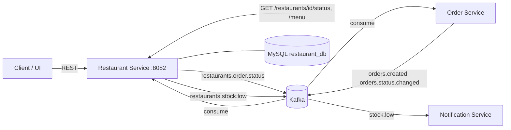
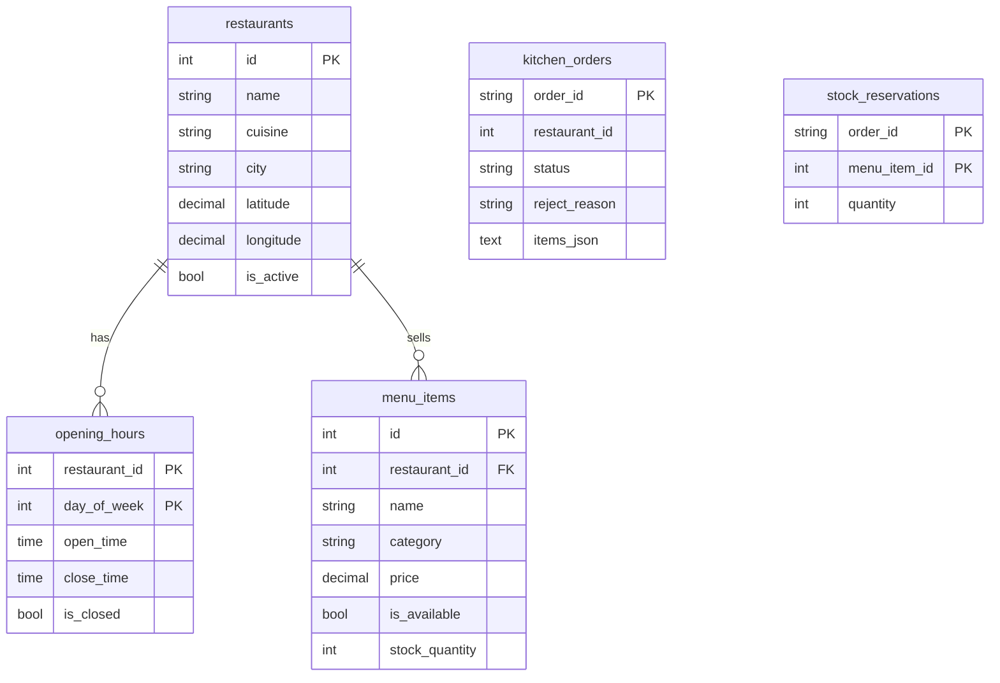

# Restaurant Service - DSA612S Assignment 2 (Person 2)

Ballerina · MySQL 8 · Kafka · port `8082`

Owns: menus, inventory, opening hours, the restaurant database, REST APIs, and the restaurant side of the order flow.

## 1. Where it sits



Database per service. The Restaurant Service never calls the Order Service. It reacts to events, so it keeps working when other services are down.

## 2. Code layout

| File | What it does |
|---|---|
| `config.bal` | configurable values (DB, Kafka, topics, low-stock threshold, UTC offset) |
| `types.bal` | API records, DB rows, Kafka event shapes |
| `utils.bal` | validation, opening-hours maths, event parsing, HTTP error helpers |
| `db.bal` | MySQL client + idempotent table creation |
| `repository.bal` | all SQL (parameterised) |
| `service_restaurants.bal` | HTTP resources + `/health` |
| `kafka_consumer.bal` | handles `orders.created` and `orders.status.changed` |
| `kafka_producer.bal` | publishes `restaurants.order.status` and `restaurants.stock.low` |
| `sql/schema.sql` | same DDL, for documentation |
| `tests/restaurant_test.bal` | unit tests |
| `scripts/` | create topics, seed demo data, fake Order Service events |

Layering: service (HTTP / Kafka) -> repository (SQL) -> db client. Handlers contain no SQL.

## 3. Data model



- `menu_items` has `CHECK (stock_quantity >= 0)`. The database itself refuses negative stock.
- `UNIQUE (restaurant_id, name)` on menu items and `UNIQUE (name, address)` on restaurants give the 409 cases.
- `kitchen_orders` has no FK to `restaurants` on purpose: orders for an unknown restaurant are stored as REJECTED so a re-delivered event is recognised.
- `stock_reservations` records what each order took, so a cancellation returns exactly that stock, once.

## 4. REST API

| Method | Path | Success | Errors |
|---|---|---|---|
| POST | `/restaurants` | 201 + Location | 400, 409 |
| GET | `/restaurants?city=&cuisine=&page=&pageSize=` | 200 | 400 |
| GET | `/restaurants/{id}` | 200 | 404 |
| PUT | `/restaurants/{id}` | 200 | 400, 404, 409 |
| DELETE | `/restaurants/{id}` | 204 | 404 |
| GET | `/restaurants/{id}/status` | 200 (`isOpen`, `acceptingOrders`) | 404 |
| PUT | `/restaurants/{id}/hours` | 200 (replaces whole week) | 400, 404 |
| GET | `/restaurants/{id}/hours` | 200 | 404 |
| POST | `/restaurants/{id}/menu` | 201 + Location | 400, 404, 409 |
| GET | `/restaurants/{id}/menu?category=&available=true` | 200 | 404 |
| GET | `/restaurants/{id}/menu/{itemId}` | 200 | 404 |
| PUT | `/restaurants/{id}/menu/{itemId}` | 200 | 400, 404, 409 |
| PUT | `/restaurants/{id}/menu/{itemId}/stock` | 200 | 400, 404 |
| DELETE | `/restaurants/{id}/menu/{itemId}` | 204 | 404 |
| GET | `/restaurants/{id}/orders?status=&page=&pageSize=` | 200 | 400, 404 |
| GET | `/restaurants/{id}/orders/{orderId}` | 200 | 404 |
| PUT | `/restaurants/{id}/orders/{orderId}/status` | 200 | 400, 404, 409 |
| GET | `/health` | 200 | 503 |

Errors share one body: `{"code":"NOT_FOUND","message":"..."}`. Days of week are `0` (Sunday) to `6` (Saturday), times are `HH:MM`.

## 5. Kafka contract (agree with Person 3, 5, 6)

| Topic | Direction | Key | Payload |
|---|---|---|---|
| `orders.created` | consume | `orderId` | `{orderId, customerId, restaurantId, totalAmount, items:[{menuItemId, quantity}]}` |
| `orders.status.changed` | consume | `orderId` | `{orderId, status}` - we only act on `CANCELLED` |
| `restaurants.order.status` | produce | `orderId` | `{eventType, orderId, restaurantId, status, reason, occurredAt}`, status is `CONFIRMED`, `REJECTED`, `PREPARING` or `READY` |
| `restaurants.stock.low` | produce | `restaurantId` | `{eventType, restaurantId, menuItemId, itemName, stockQuantity, occurredAt}` |

What Person 3 must do: put `menuItemId` and `quantity` on every item in `orders.created`, and consume `restaurants.order.status` to move the order through CONFIRMED -> PREPARING -> READY (or CANCELLED on REJECTED). If their field names differ, change only `parseOrderCreated` in `utils.bal`.

Reliability:
- producer `acks=all`, 3 retries
- consumer group `restaurant-service-group` (separate from the Customer Service group, so both get every order)
- duplicate `orders.created` is ignored (the order id is already in `kitchen_orders`)
- each record has its own error scope, so one poison message can't block a partition
- a Kafka outage never fails an HTTP request

## 6. Run it

Needs Ballerina 2201.10.x and Docker.

```bash
docker compose -f docker-compose.dev.yml up -d mysql kafka
./scripts/create-topics.sh

cp Config.toml
bal run                     

./scripts/seed-demo.sh        // restaurant 1 + hours + 3 menu items
bal test                      // needs the DB up
```

Or all in containers: `docker compose -f docker-compose.dev.yml up -d --build`.

## 7. Demo script

```bash
curl -s localhost:8082/restaurants/1/menu                 # note Boerewors Roll stock = 3
curl -s localhost:8082/restaurants/1/status

./scripts/publish-test-events.sh ord-1 1 2 2              # order 2 rolls
curl -s localhost:8082/restaurants/1/orders               # ord-1 CONFIRMED
curl -s localhost:8082/restaurants/1/menu/2               # stock now 1, low-stock event sent

./scripts/publish-test-events.sh ord-2 1 2 2              # only 1 left -> REJECTED
curl -s -X PUT localhost:8082/restaurants/1/orders/ord-1/status \
  -H 'Content-Type: application/json' -d '{"status":"PREPARING"}'
curl -s -X PUT localhost:8082/restaurants/1/orders/ord-1/status \
  -H 'Content-Type: application/json' -d '{"status":"PREPARING"}'    # 409, already PREPARING
```

## 8. Defence notes (what and why)

- **Why does stock live in the same table as the menu item?** The stock check and the decrement have to be one atomic step. `UPDATE ... WHERE stock_quantity >= qty` does that in one statement, so two orders can't both take the last portion. A separate inventory table would need a join or a lock.
- **Why a transaction in `acceptOrder`?** An order with 3 items must take all the stock or none of it. If item 3 is sold out, items 1 and 2 are rolled back.
- **Why `stock_reservations`?** Cancelling must give back exactly what that order took, and only once. The table plus `SELECT ... FOR UPDATE` on the order row makes a double cancel harmless.
- **Why consume `orders.created` instead of the Order Service calling us?** No synchronous coupling. If we are down, events wait in Kafka and are processed on restart. Retries and duplicates are safe because processing is idempotent.
- **Why reject through an event and not an HTTP error?** The order is already created by the time we look at it. The Order Service learns the outcome from `restaurants.order.status`.
- **Why a `REJECTED` row?** It makes duplicate deliveries idempotent and lets the restaurant see what it turned away.
- **Why key by `orderId`?** All events for one order land in one partition, so they stay in order.
- **Why UTC offset in config?** Namibia is UTC+2 all year. Opening hours are local time, the server runs in UTC.
- **Why is a restaurant with no hours "always open"?** So a freshly created restaurant works without extra setup. Easy to flip if the team prefers the opposite.
- **Security:** parameterised SQL everywhere. Not done: authentication and roles (any caller can edit a menu). Say so if asked.

## 9. Known limitations

- No JWT or role checks.
- Publishing to Kafka happens after the DB commit. A crash between the two loses the event (the outbox pattern would fix this).
- Cancelling returns stock even if the food is already prepared.
- Tests that touch only validation/parsing still need MySQL running because `init()` runs on module load.
